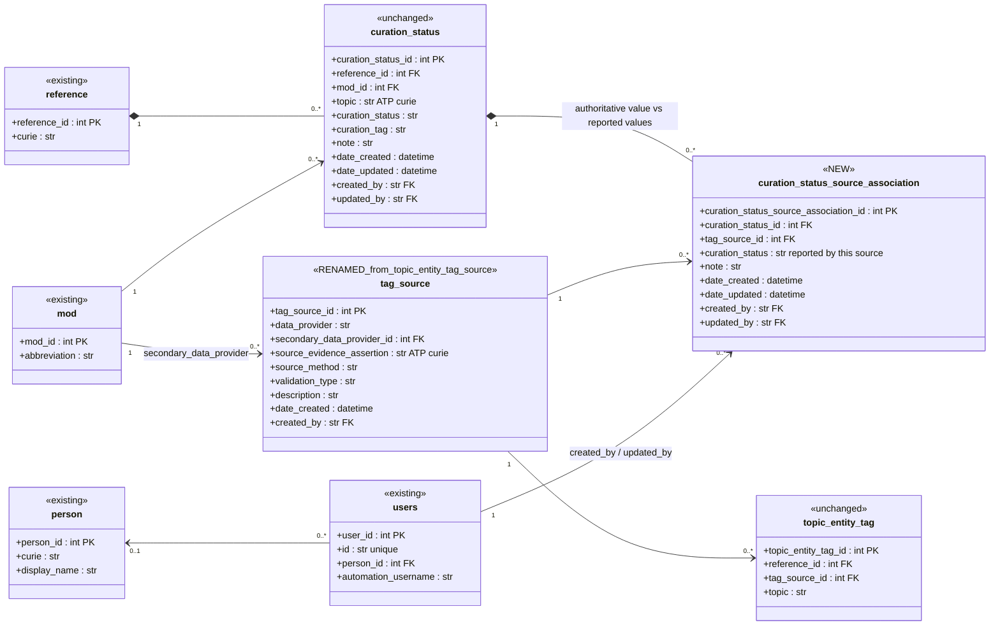
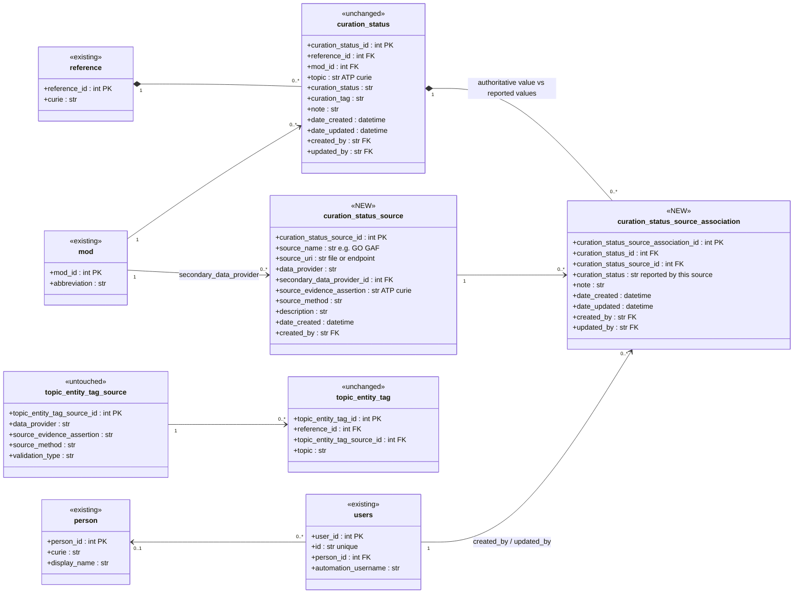

# Tracking multiple sources per curation_status entry — design proposal

**Status:** proposal for discussion
**Date:** 2026-07-31

> **Terminology.** Throughout this document "curation_status entry" means a row of the
> `curation_status` table. It is deliberately *not* called a "curation tag": `curation_tag`
> is an existing column on both `curation_status` and `workflow_tag`, and reusing the word
> for the row itself would be ambiguous.

## Problem

Curators want to know *where* the information behind a curation_status entry came from, and
*what each source said*. For one topic on one paper the information can arrive from several
places — a GAF file load, a MOD data submission, a manual curator assertion in the UI —
and today none of that is recorded.

The entry itself has to stay single. `curation_status` is unique on
`(topic, reference_id, mod_id)`: exactly one row, one current state, per topic per paper
per MOD. That is the behaviour we want to keep.

## The distinction to be clear about

This is the part worth stating out loud before any of the schema, because it is the easy
thing to get wrong:

> **The curation_status entry tracks the workflow. The sources report; they do not drive
> it.**

- A **curation_status entry is workflow state.** It has one current value, it moves through
  defined transitions, and it is authoritative. That is what curators act on, and it is
  what the rest of the system reads.
- A **source contribution records what that source reported** — a status value of its own,
  alongside the provenance of where it came from. That value is *informational*. It never
  drives, overrides, or blocks the entry.

Four consequences fall out of that, and they are what the model below encodes:

1. **Two levels of status coexist.** `curation_status.curation_status` is authoritative
   and single. `curation_status_source_association.curation_status` is per contribution
   and informational. The second never silently becomes the first.
2. **They are allowed to disagree.** A GAF load reporting `curated` against an entry
   sitting at `no data` is not an error or a data-integrity problem — it is precisely the
   information curators asked to see.
3. **Reconciliation is manual.** Nothing recomputes the entry from its contributions. There
   is no precedence order, no last-write-wins across sources, no automatic promotion. A
   curator reads the contributions and sets the entry's status.
4. **The two are decoupled in both directions.** Recording a contribution never moves the
   workflow; changing the entry never rewrites or clears the contribution log.

## Proposal

Keep `curation_status` as the single current-state row, and attach an **association
table** holding one row per **contribution**. Each row carries the status that source
reported plus the audited-object fields, so every contribution is attributable to a person
(or an automation user) and timestamped independently of the entry itself — the row's
`date_created` / `created_by` record when and by whom it was made.

Note that this is one row per *contribution*, not per source: the same source may appear
against the same entry more than once. If a GAF load supplies GO information in March and
again in July, that is two rows, and both stay. Repeat contributions are exactly the
history curators want to see, so there is deliberately no unique constraint collapsing
them. A consequence worth spelling out: because a source can contribute repeatedly and
report a different value each time, "what does this source currently say" is the most
recent row for that source, not the only one.

**Reconciliation.** Disagreement needs no extra machinery to detect — it is a comparison
between the association rows and their parent (`assoc.curation_status IS DISTINCT FROM
parent.curation_status`), so no flag column is proposed. What it needs is a curator: they
look at the contributions, decide, and set `curation_status.curation_status` themselves.
That write is an ordinary entry update, audited as it is today; it does not touch the
contribution log, and the log keeps showing what each source reported even after the entry
moves away from it.

Two options differ only in **how the source vocabulary is modelled**. Everything else is
identical.

---

## Option A — rename `topic_entity_tag_source` to `tag_source` and share it

One source vocabulary shared by topic entity tags and curation statuses.

**Constraints**

- **No unique constraint** on `(curation_status_id, tag_source_id)`. Repeat contributions
  from the same source are allowed and each gets its own row, so the table reads as an
  append-only contribution log per entry.
- **No constraint tying `curation_status_source_association.curation_status` to its
  parent's value.** They are deliberately free to differ — that is the whole point. Both
  draw from the same value vocabulary as `curation_status.curation_status`.
- FK to `curation_status` is `ON DELETE CASCADE`; FK to `tag_source` is `ON DELETE RESTRICT`
  (a vocabulary row in use must not disappear).

**Trade-offs**

- One vocabulary to curate, one set of ATP evidence-assertion terms, one place for
  curators to learn "what is a source".
- A source used by both a TET and a curation status is literally the same row, so
  provenance reporting can join across both without a mapping.
- Cost: `topic_entity_tag_source` is referenced well beyond the API — Debezium /
  ksqlDB / Flink reindex pipelines, Elasticsearch mappings, one-off scripts and the UI.
  A rename is a coordinated migration, not just an Alembic `alter_table`. A view or an
  alias retained on the old name reduces, but does not eliminate, that work.
- `validation_type` is TET-specific and would be meaningless (nullable, always empty)
  for curation-status rows — the shared table gets slightly muddier over time.

---

## Option B — dedicated `curation_status_source` table

A separate vocabulary whose fields are shaped for curation-status provenance.

**Constraints** — same as Option A, with `curation_status_source_id` in place of
`tag_source_id`.

**Trade-offs**

- Zero disruption: `topic_entity_tag_source` and every downstream pipeline that reads it
  stay exactly as they are.
- Fields can be tailored — `source_name` and `source_uri` (which GAF file, which release)
  — without polluting the TET source table; and no dead `validation_type`.
- Cost: two vocabularies to maintain. "SGD manual curation" will exist twice with two
  different IDs, so any cross-cutting provenance report needs a mapping or a UNION.
- Risk of drift: the two tables' `source_evidence_assertion` / `source_method` values
  can diverge unless we agree they draw from the same ATP branch.

---

## Open questions

1. **A or B.** The real question is whether "a source" is one concept across the whole
   ABC or two. If it is one concept, the rename cost in A is worth paying once; if
   curation-status provenance needs file-level detail TETs never will, B is honest.
   A third path exists: create `curation_status_source` now (B), and merge into a shared
   `tag_source` later if the two tables converge.
2. **Value history — `curation_status` is not versioned.** Continuum covers most of the
   schema (29 models carry `__versioned__`), but `curation_status` was never opted in:
   no `__versioned__` on `CurationStatusModel`, no version table in any migration, and
   no `curation_status_version` in the dev database (verified 2026-07-31 — only
   `workflow_tag_version` and `topic_entity_tag_version` are there). So "when did this go
   from `no data` to `curated`" is currently unanswerable for curation_status entries, and
   the contribution log proposed here is not a substitute for it. **Question for curators:
   do they need value history on this table?** If yes, it is a one-line `__versioned__`
   addition plus a migration — small, but its own ticket rather than folded in here.
3. **Paper-level tags.** `workflow_tag` (per reference + mod, ATP term + `curation_tag`)
   is the paper-level analogue and takes the identical pattern via a
   `workflow_tag_source_association` table. Out of scope here; worth confirming that
   curators want it there too.
4. **Surfacing disagreement.** Manual reconciliation only works if curators can find the
   disagreements. Is an on-demand comparison enough — a filter or report listing entries
   whose contributions differ from the entry itself — or do they want to be actively
   notified when a load produces a value that conflicts with the current entry? This is a
   UI and reporting requirement rather than a schema one; the data supports either.
5. **Naming.** `curation_status_source_association` follows the existing
   `mod_corpus_association` precedent. Shorter alternatives (`curation_status_source_link`)
   are fine if people prefer. Separately, the association's `curation_status` column sits
   next to `curation_status_id` (the FK to the parent), which reads ambiguously —
   `reported_curation_status` would be unmistakable at the cost of diverging from the
   parent column's name.

## Migration notes

- Both options are additive for existing rows: current `curation_status` rows simply have
  zero associated sources until backfilled.
- A backfill can seed one association row per existing `curation_status` from its
  `created_by` / `date_created`, mapped to a "legacy / unknown" source, so the UI never
  has to special-case an empty source list.
